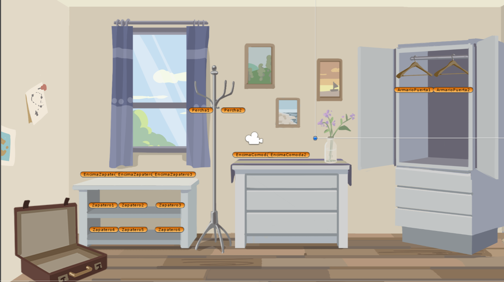
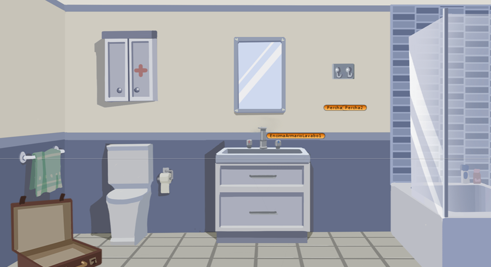
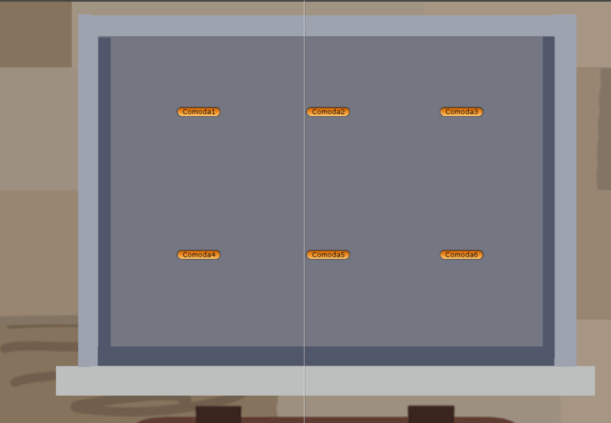
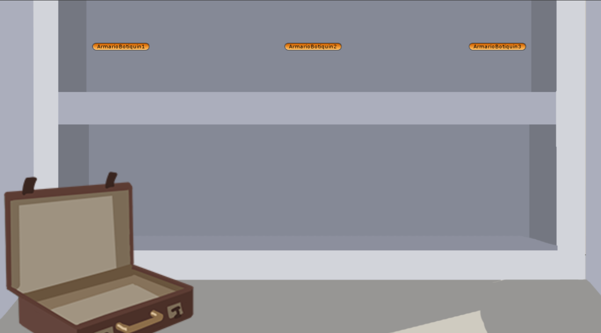

## Cómo modificar el archivo de niveles

- Los ficheros a modificar están en ```Assets/Resources/LevelInfo```. A excepción del tutorial, los nombres de los niveles se identifican por su número y por el clima; por ejemplo, el archivo con los objetos del nivel 1 en el clima cálido sería ```Level1Warm.json```

- Cada fichero tiene 2 objetos esenciales: 

  - ```objectList```, que tiene 3 arrays con los objetos a meter en la maleta según el género. Aquí solo es necesario rellenar los arrays correspondientes con las IDs de los objetos.

  - ```storagePoints```: array que contiene los 16 puntos de almacenamiento, siendo cada uno un objeto con el nombre (```id```) del punto y otro objeto (```objects```) con 3 arrays para los objetos que aparecerán en el nivel. Simplemente hay que
  rellenar los arrays de los género correspondientes con objetos que tengan la ID del objeto (```id```) y un entero con su posición en dicho punto de almacenamiento (```position```). Los puntos naranjas que se muestran en las imágenes son los puntos de almacenamiento colocados en la escena. 

 - En ambos casos, los géneros posibles son ```M``` (masculino), ```F``` (femenino) y ```N``` (neutro, que será válido para ambos géneros)
  
 - Tampoco es necesario definir los 3 arrays para los géneros en ```objectList``` ni en ```objects```, ni definir todos los puntos de almacenaje en ```storagePoints```.

  <br>

  
  
  
  

<br>

Ejemplo: ```Tutorial.json```
```
{
	"objectList": {
		"M": [],
		"F": [],
		"N": [
			"YellowTShirt"
		]
	},
	"storagePoints": [
		
		...
		
		{
			"id": "Closet",
			"objects": {
				"M": [],
				"F": [],
				"N": [
					{
						"id": "YellowTShirt",
						"position": 1
					}
				]
			}
		},
		{
			"id": "Rack",
			"objects": {
				"M": [],
				"F": [],
				"N": [
					{
						"id": "Coat",
						"position": 0
					}
				]
			}
		},

		...
	]
}
```
<br>

## Información necesaria para configurar el archivo de niveles

### Objetos
**NOTA**: Es recomendable configurar un máximo 12 de objetos en la lista de objetos a guardar en la maleta

| Objeto | ID (```string```) | Escena | Puntos de almacenaje |
| ------------- | ------------- | ------------- | ------------- |
| **Abrigo** | ```Coat``` | Dormitorio | Perchero |
| **Camisa hawaiana** | ```HawaiianShirt``` | Dormitorio | Cualquier cajón |
| **Blusa verde** | ```GreenBlouse``` | Dormitorio | Puerta del armario |
| **Camisa roja** | ```RedShirt``` | Dormitorio | Puerta del armario |
| **Camiseta amarilla** | ```YellowTShirt``` | Dormitorio | Puerta del armario |
| **Jersey** | ```Jersey``` | Dormitorio | Puerta del armario |
| **Camiseta verde** | ```GreenTShirt``` | Dormitorio | Cualquier cajón |
| **Camiseta de tirantes** | ```TankTop``` | Dormitorio | Cualquier cajón |
| **Pijama de tirantes** | ```StrappyPajamas``` | Dormitorio | Cualquier cajón |
| **Pijama de seda** | ```SilkPajamas``` | Dormitorio | Cualquier cajón |
| **Pijama de invierno** | ```WinterPajamas``` | Dormitorio | Puerta del armario |
| **Vestido** | ```Dress``` | Dormitorio | Puerta del armario |
| **Falda** | ```Skirt``` | Dormitorio | Cualquier cajón |
| **Bikini** | ```Bikini``` | Dormitorio | Cualquier cajón |
| **Bañador** | ```Swimsuit``` | Dormitorio | Cualquier cajón |
| **Bermudas** | ```Bermuda``` | Dormitorio | Cualquier cajón |
| **Pantalones largos** | ```Jeans``` | Dormitorio | Cualquier cajón |
| **Pantalones cortos** | ```Shorts``` | Dormitorio | Cualquier cajón |
| **Calcetines** | ```Socks``` | Dormitorio | Cualquier cajón |
| **Tacones** | ```Heels``` | Dormitorio | Zapatero |
| **Deportivas** | ```Sneakers``` | Dormitorio | Zapatero |
| **Zapatos de tela** | ```ClothShoes``` | Dormitorio | Zapatero |
| **Chanclas** | ```FlipFlops``` | Dormitorio | Zapatero |
| **Botas** | ```Boots``` | Dormitorio | Zapatero |
| **Gorra** | ```Cap``` | Dormitorio | Encima del zapatero/cómoda |
| **Bolso** | ```Handbag``` | Dormitorio | Perchero |
| **Riñonera** | ```FannyPack``` | Dormitorio | Encima del zapatero/cómoda |
| **Bufanda** | ```Scarf``` | Dormitorio | Cualquier cajón |
| **Gorro** | ```Beanie``` | Dormitorio | Cualquier cajón |
| **Cinturón** | ```Belt``` | Dormitorio | Encima del zapatero/cómoda |
| **Gafas de buceo** | ```DivingGoggles``` | Dormitorio | Encima del zapatero/cómoda |
| **Gafas de ski** | ```SkiGoggles``` | Dormitorio | Encima del zapatero/cómoda |
| **Reloj** | ```Watch``` | Dormitorio | Cualquier cajón |
| **Guía de viajes** | ```TravelGuide``` | Dormitorio | Cualquier cajón |
| **Libro** | ```Book``` | Dormitorio | Encima del zapatero/cómoda |
| **Pareo** | ```Sarong``` | Baño | Cualquier cajón |
| **Neceser** | ```ToiletryBag``` | Baño | Cualquier cajón |
| **Peine** | ```Comb``` | Baño | Cualquier cajón |
| **Pasta de dientes** | ```Toothpaste``` | Baño | Cualquier cajón |
| **Cepillo de dientes** | ```Toothbrush``` | Baño | Cualquier cajón |
| **Toalla** | ```Towel``` | Baño | Percha |
| **Colonia** | ```Cologne``` | Baño | Encima del Lavabo |
| **Bote de medicinas** | ```Pills``` | Baño | Armario botiquín |

### Puntos de almacenaje 

| Puntos de almacenaje  | ID (```string```) | Escena | Huecos disponibles (```int```)|
| ------------- | ------------- | ------------- | ------------- |
| **Encima de la cómoda** | ```Dresser``` | Dormitorio | 2 (0-1)|
| **Cajón inferior de la cómoda** | ```Dresser_Drawer_bottom``` | Dormitorio | 6 (0-5)|
| **Cajón medio de la cómoda** | ```Dresser_Drawer_middle``` | Dormitorio | 6 (0-5)|
| **Cajón superior de la cómoda** | ```Dresser_Drawer_top``` | Dormitorio | 6 (0-5)|
| **Puerta de Armario** | ```Closet``` | Dormitorio | 2 (0-1)|
| **Cajón inferior del armario** | ```Closet_Drawer_bottom``` | Dormitorio | 6 (0-5)|
| **Cajón medio del armario** | ```Closet_Drawer_middle``` | Dormitorio | 6 (0-5)|
| **Cajón superior del armario** | ```Closet_Drawer_top``` | Dormitorio | 6 (0-5)|
| **Perchero** | ```Rack``` | Dormitorio | 2 (0-1)|
| **Encima del Zapatero** | ```ShoeRack_above``` | Dormitorio | 3 (0-2)|
| **Zapatero** | ```ShoeRack``` | Dormitorio | 6 (0-5)|
| **Percha** | ```Bathroom_Hanger``` | Baño | 2 (0-1)|
| **Encima del Lavabo** | ```Sink``` | Baño | 1 (0)|
| **Cajón superior del Lavabo** | ```Sink_Drawer_top``` | Baño | 6 (0-5)|
| **Cajón inferior del Lavabo** | ```Sink_Drawer_bottom``` | Baño | 6 (0-5)|
| **Armario de botiquín** | ```Cabinet``` | Baño | 3 (0-2) |

